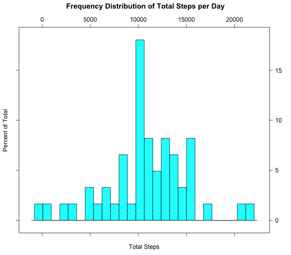
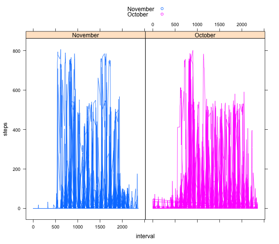
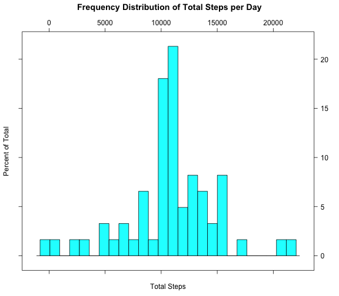
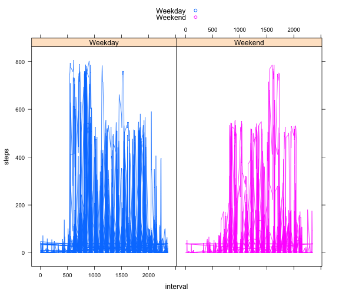

RepData_PeerAssessment1
============================
## What is mean total number of steps taken per day?
### Part 1
#### Attaching required libraries

```r
require("lattice", warn.conflicts = F, quietly = F)
require("dplyr", warn.conflicts = F, quietly = F)
```
#### Read in the activity.csv file

```r
activity<-read.csv("activity.csv", stringsAsFactors=F)
```
#### Convert "chr" forms of dates from the activity file to "Date" class

```r
dates<-as.POSIXlt(strftime(activity$date, format="", usetz=F))
dates<-as.Date(dates, format="%d%m%Y")
activity$date<-dates
```
#### Use the dplyr library to calculate the total steps per day

```r
steps_perDayTotal<-summarise(group_by(activity, date), sum(steps))
total_steps<-sum(steps_perDayTotal$"sum(steps)", na.rm=T)
total_days<-dim(steps_perDayTotal)[[1]]
cat("The total number of taken per day is: ", total_steps/total_days, "\n\n")
```

```
## The total number of taken per day is:  9354.23
```

### Plot the frequency distribution of total steps per day

```r
print(histogram(~`sum(steps)`, data=steps_perDayTotal, xlab="Total Steps", type="percent", scales=list(alternating='2', cex=c(0.9,1)), nint=26, auto.key=T, main="Frequency Distribution of Total Steps per Day"))
```

 

#### Calculate the mean steps per day

```r
steps_means<-mean(steps_perDayTotal$"sum(steps)", na.rm=T)
cat("The mean number of steps is: ", steps_means, "\n\n")
```

```
## The mean number of steps is:  10766.19
```
#### Calculate the median steps per day

```r
steps_median<-median(steps_perDayTotal$"sum(steps)", na.rm=T)
cat("The median number of steps is: ", steps_median, "\n\n")
```

```
## The median number of steps is:  10765
```

#### Inputing missing values

```r
activity<-dplyr:::mutate(activity, NAs = is.na(steps))
activity_NAs<-dplyr:::filter(activity, NAs==TRUE)%>%summarise(n())
```

#### Generate the activity plot

```r
activity_w_Interval<-group_by(activity, steps, interval)
activity_months<-months(activity_w_Interval$date)
lattice:::xyplot(steps~interval|activity_months, data=activity_w_Interval, groups=activity_months, type="l", auto.key=T)
```

 

#### Find the maximum value of for the number of steps taken

```r
activity_summary<-summary(activity)
maxSteps<-range(activity$steps, na.rm=T)[[2]]
maxInterval<-dplyr:::filter(activity, steps==maxSteps)
maxInterval_month<-months(maxInterval$date)
maxInterval<-maxInterval$interval
cat("The maximum number of steps occured in at interval: ", maxInterval,"\n\n")
```

```
## The maximum number of steps occured in at interval:  615
```

```r
cat("During the month of: ",maxInterval_month, "\n\n")
```

```
## During the month of:  November
```

```r
activity_NAs<-dplyr:::mutate(activity, NAs = is.na(steps))
activity_NAs_count<-dplyr:::filter(activity_NAs, NAs==TRUE)%>%summarise(n())

cat("The total number of missing values is: ", activity_NAs_count$"n()", "\n\n")
```

```
## The total number of missing values is:  2304
```

```r
steps_perDayMean<-summarise(group_by(activity, date), mean(steps,  na.rm=T))
steps_perDayMedian<-summarise(group_by(activity, date), median(steps,  na.rm=T))
```
#### Procedure to subsitute means for NAs values in the activities table

```r
activities_filled<-data.frame()
colnames(steps_perDayMean)[2]<-"mean"
for(i in 1:dim(steps_perDayMean)[[1]])
{
z=i
act_date_match<-dplyr:::filter(activity, date==steps_perDayMean$date[i])
for(i in 1:dim(act_date_match)[[1]])
{
if(is.na(act_date_match[i,1]))
{
act_date_match[i,1]<-steps_means/dim(act_date_match)[[1]]
}
}
activities_filled<-rbind(activities_filled, act_date_match)
}
```


```r
steps_perDayTotal_filled<-summarise(group_by(activities_filled, date), sum(steps))
total_steps_filled<-sum(steps_perDayTotal_filled$"sum(steps)", na.rm=T)
total_days_filled<-dim(steps_perDayTotal_filled)[[1]]
```

#### Show the data histogram after filling in the missing values

```r
print(histogram(~`sum(steps)`, data=steps_perDayTotal_filled, xlab="Total Steps", type="percent", scales=list(alternating='2', cex=c(0.9,1)), nint=26, auto.key=T, main="Frequency Distribution of Total Steps per Day"))
```

 
#### Report the data for steps after filling in the missing values

```r
cat("The total number of steps taken per day after filling is: ", total_steps_filled/total_days_filled, "\n\n")
```

```
## The total number of steps taken per day after filling is:  10766.19
```

```r
steps_means_filled<-mean(steps_perDayTotal_filled$"sum(steps)", na.rm=T)
cat("The mean number of steps after filling is: ", steps_means_filled, "\n\n")
```

```
## The mean number of steps after filling is:  10766.19
```

```r
steps_median_filled<-median(steps_perDayTotal_filled$"sum(steps)", na.rm=T)
cat("The median number of steps after filling is: ", steps_median_filled, "\n\n")
```

```
## The median number of steps after filling is:  10766.19
```

#### Convert weekdays and weekends and add these factors to the table

```r
weekday<-weekdays(dates)
activities_filled<-dplyr:::mutate(activities_filled, day_class=weekday)
activities_filled$day_class<-gsub("Monday", "Weekday",activities_filled$day_class )
activities_filled$day_class<-gsub("Tuesday", "Weekday",activities_filled$day_class )
activities_filled$day_class<-gsub("Wednesday", "Weekday",activities_filled$day_class )
activities_filled$day_class<-gsub("Thursday", "Weekday",activities_filled$day_class )
activities_filled$day_class<-gsub("Friday", "Weekday",activities_filled$day_class )
activities_filled$day_class<-gsub("Saturday", "Weekend",activities_filled$day_class )
activities_filled$day_class<-gsub("Sunday", "Weekend",activities_filled$day_class )
```

#### Generate the plot of activities on weekends versus weekdays

```r
print(lattice:::xyplot(steps~interval|day_class, data=activities_filled, groups=day_class, type="l", auto.key=T))
```

 
